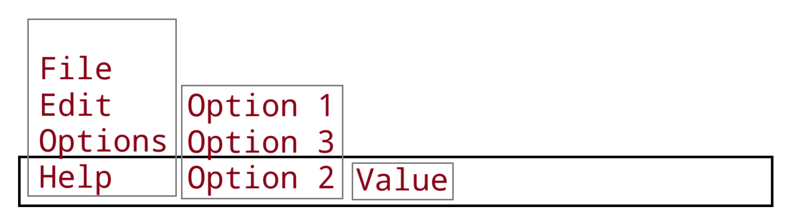

> Every heading under this one represents a component of the application, and the hierarchy of the headings is analogous to the structure of the application.
> However, this is not exhaustive overview of *all* components (some don't need to have an entire heading), and any heading surrounded by parenthesis `()` is NOT a component, but just a heading for some other related block of information.

---
# Front-End UI

Web-based frontend (vanilla HTML, CSS, JS), powered by the backend local server.

## Tab Bar

Will store a tab for each instance of a view (log/scheduler or tree-browser) 

## Main Viewer

This will take up the most space of the overall application window, and will be populated by different views.
- Each view instance will have a title (which will also be the label for the **tab** containing the view).

### Tree-Browser View

This allows viewing all file entries like an unfolding tree structure, like a file browser which can unfold its folders and display the files/folders inside it. Each entry will be a block visually, and indentation will denote its hierarchical level (again, like a tree chart). Each entry block will display typical information like the name and other meta-data, but unlike a typical file browser, the file content can also viewed and even edited within the same space.
- This allows for looking at the structure of the files, and files themselves, at the same time within the same view. Notes are like both files and folders at the same time. They are structured in a hierarchical manner as usual, but not linear (multiple parent containers)
- The title of the main-view/tab which contains a tree-file-browser, will match the overall content that is being displayed, and is like the top level of the hierarchy. 
	- For example: If the only thing in view is an entry called "Movies", the overall title of the view will be "Movies". But in another case, if what's being viewed is a search query for all entries with the word "orange" in them, then the overall view title would be something like: 'Search for titles with "orange"'.

#### File-like Entries

These are the visual boxes which represent each entry within the Tree-Browser view.

- An entry that's a "note" type will look like this, from top to bottom: 
	- header
		- title
		- properties
	- body
		- content (from associated file content)
- Then, on the next indentation level (to the right) under this entire entry block, will be a block for all other entries that are sub-linked under this one.
	- This may be visually separated or ordered by type, time, title, or any other property.
- If the file attached is a markdown text file, then its content will be rendered in a specific way (see [User Files](#user-files))
- Entry's may look slightly different depending on their *type* (ex: notes will have one colour scheme, and logs another)
- Also, depending on the file that's attached to an entry will be rendered differently depending on the type of file it is (i.e. an image file will be rendered in an image element, a text file will be rendered in a multi-line text input or paragraph element, a video gets a video element alone with controls for that video, etc.)

### Log-Schedule View

This will provide a view of and organizational scheme for all tasks and log entries.
- By default, this will look like a linear chronological list (like a terminal, newest at the bottom) of each entry, and ONLY contain events which have already happened.
	- However, can this view also orient entries in other forms, like a calendar or day planner.
		- In the case of these, future scheduled events will be shown, just like any schedule would. Then any new events/logs will be inserted as they happen and are created.
- Additionally, while all entries are usually shown, there is the option to *filter* the entries to only show those which match the filter parameters.
- Each entry will be a box and will always display the event/task's time, event description, and type (event vs log). 
- Additionally, there is also a drop-down arrow or button to view any file-entries which are associated with that event (ex: if an event was recorded for reading,  creating, or editing a file entry, then the content and meta-data of that entry is viewable).
	- Unlike the tree browser view, this does NOT allow you to edit the entry, and it does NOT allow a view of the content of any other entries sub-linked under that one.
	- *However*, should you edit the file (there may or may not be an edit button for the entry within this view), the log will create a new event outlining this edit, and scroll to it so it's in view.
#### Task/Event Entries

These are the visual boxes which represent each entry within the Log-Schedule view. They are similar to the entries in the tree-browser view, but may look a bit different.

## Command Bar

> see [Command Module](#command-module) for more details on how commands are structured

Will accept all commands for the current tab or global commands. Commands are the primary way to perform actions or interact with the application. This is used in place of typical GUI elements like buttons. I like graphical programs, but I love the simplicity of terminal apps, so I wanted to combine both in a sense.

> Having said this, there will still be other traditional GUI elements like buttons, but they will be local to individual UI elements (like file entry boxes, etc.))

All input in the command bar must conform to a special syntax which outlines command queries. The bar will behave like a normal text input field, but will automatically render the options above/below the text as it's typed, and will provide the mechanics to use mouse or arrow keys to select other options.
- The text input can be multi-line, as to provide easier readability for larger input strings.

This may look a bit like this: 


The first part of every command query must be a name of a command, and the subsequent parts will be arguments. The options which appear above the text for arguments will all depend on which command name is entered, and options for this first part will always be a list of all possible commands. However if no initial name is provided, then it will be a *search* command. So by default, the command bar will act just like a search bar and treat the input as a search query.

Once text is entered, the JS program will convert the string into JSON, and that JSON will be passed to the server to further process the command. 

Apart from text, the user may also use voice (or possibly other input types such as gestures, etc.). Regardless, all input will eventually be converted into text/JSON.

## (Overall Front-End Programming Details)

- Input and output will be solely handled by the front-end. This includes things like: collecting text input, button pressed and any other GUI element interaction, audio output, audio recording and input, playing media files, etc.
	- The only thing it *won't* handle on its own is converting audio of speech into text for commands. It will record the audio from a user, but then that audio will be sent to the server to convert it into a text command query. Then this will go through the usual channels for handling text commands.
- When the "content" part of an entry is edited/created, then it essentially just updates the content of the file associated with that entry. So if an entry only has properties but no content section, then it has no associated file (or the file is empty)
	- If only the content of an entry is edited, then its properties are unaffected (except for the "modified" time which gets updated)

---
# Back-End Local Server

Flask server powering the frontend and connecting it to other back-end Python modules.

## Main Script (Server)

- works with JSON as input and output for its endpoints
- one of the integral end points is for commands
	- accept JSON (as usual) but then connects to command module, and matches command query to 
## Modules

These are Python modules which provide various functionality for the overall application to function, as well as for command functionality

Some of these are:
- Library module for fundamental CRUD operations on entries
- Command processing module
- Speech recognition module

### Command Module

Commands provide a way for the user to perform actions and act as the primary vehicle for performing actions in the app.

Commands are structured much like the command of a terminal CLI would be. They are comprised of text and all must start with the command name, followed by arguments/options to be passed to the command, with everything being separated by whitespace. 

- Commands are built off of functions which are decorated with another function which turns them into commands
	- this decorator automatically registers the function in a dictionary to store all commands, and also provides mechanism to define each command's parameters
- All commands (decorated functions) should be in a single module for organization

The commands parameters are as follows:
- **name**: the unique keyword which identifies the command. This is also the the token which a command input string must begin with in order to identify the command (so just like a CLI).
	- can be multiple words, but must all be at the beginning and in the correct order
- **pre-requirements**: requirements which must be met *in addition* to the name in order for the command to be selected. Will be checked *before* the presence of the name is checked.
	- Either functions which must return `True` or a dict with properties which the program will use to make checks
- **arguments**: the arguments to be passed to the command and its function.
	- Will become a dict which is passed as keyword args to the function.
	- All args will have an associated keyword, but can be be treated as positional if provided in order, *before* any keyword args are defined
	- all arguments will be either strings, numbers, or boolean. (so no complex types)
- **function**: this is the actual function that's decorated and that the command is built off of. It gets called when all parameters are validated. This is the actual action which the command performs.

---
# User Library

A single directory which can be read-from/written-to by the rest of the program, containing user files and app data. This comprises all of the actual data that the other components will act upon.

Will have this structure:
```
user-library/
├── .data/
│   ├── settings.json
│   ├── log.txt
│   ├── entries.json
│   ├── entry_rules.json
│   └── search_index.json
└── (all user files)
```
- `.data` - a data folder to store special files for the app to use
	- `settings.json` - contains overall app settings for this library
	- `log.txt` - a log of all events which happened for this library (not the same as "log" entry type). Will ONLY have events, not the actual log files!
		- all log entries are created automatically by the program. The user never directly affects this file.
	- `entries.json` - the file with all of the library's entries. Most user files in the library are indexed here by an associated entry.
	- `entry_rules.json` - the rules for the entries file (like all entry types, and their allowed properties and values)
	- `search_index` (maybe) - to be generated and used by the program to make queries go faster
- `(all user files)` - the actual files which the `entries.json` is built around. Holds most if not all of the actual *content* for entries (which are just meta-data)

### `entries.json` Data File

The File Index is a JSON file contain an entry for all files (but also entries which don't correspond to files). Each entry is just an object with properties.
- Note or Log type entries usually have a file associated with them, but a task may not have a file if there is no need for one.
- All entries are here, regardless of type (there is no separate file for each entry type)

These are the fundamental base properties which all entries must have:
- **Title** - overall title of the entry - must be unique among all other entry titles, and acts as the main ID for the entry
- **Time** - the creation time of the the entry
- **File** - the path/URI to a file or web-page, etc. (essentially the entry's content)
	- if the path leads to a local file in the library, then this file can be edited. If it leads to something like a web-page, then obviously the content of the web-page will be for display only
- **Type** - the type of entry this is. Different types determine how the program will treat them and what properties they should have
	- Here are the most common types:
		- Logs (leaves)
		- Notes/Documents (branches)
		- Tasks
			- Events/alarms
- **Supers** - a list of titles for other entries which this entry is hierarchically linked "under"

Other common (but not core) properties
- Subs - the opposite of supers - list of entry titles which this is linked "over" 
- Sub-rules/properties - a dict of properties which subs of this entry must have.
	- OR this can be "Sub-Type", which specifies the type of entry all their children must be, and the type will store details on what properties they could have!
		- (type details will be library settings data file)

Type specific properties:
- logs (logs use only the base properties)
- notes
	- modified - last time the entry was modified (file content or properties)
	- sub-links - a list of titles for all of the entries which are sub-linked under this one
	- (optional) sub-type - the type which all sub-linked entries must
- tasks
	- (need to think through this further)
	- sub-links
	- no priority, just deadline
		- there will also be a "doing time"
	- tasks with a "doing time" will always take priority, as they are immovable

### User Files

- Most of the entries in the index correspond to files in the user library. These files can be text files, csv, media types (image, video, audio), or any other type of file.
- In the case of text files, if they're a **markdown** (`.md`) file, then UI will render them with all formatting as expected. Additionally, there can be special code blocks or some other syntax which allows for things like:
	- search queries (use same syntax as a search command), which render the results within the file's content space in the UI
		- this would usually be for rendering lists of other entries with certain properties/values, and sorting rules
	- links/embed-links to load other files (ex: including an image within a text document)


